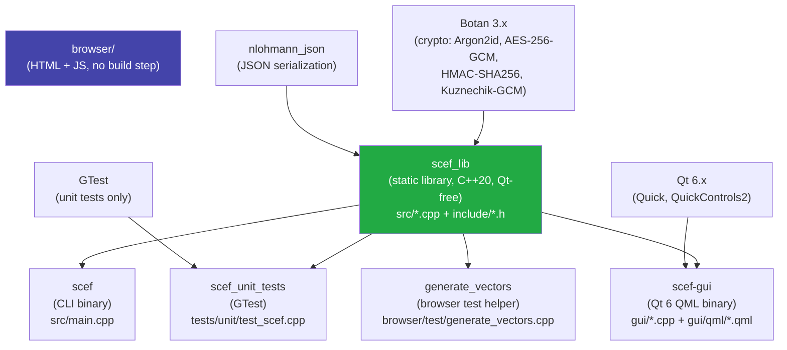
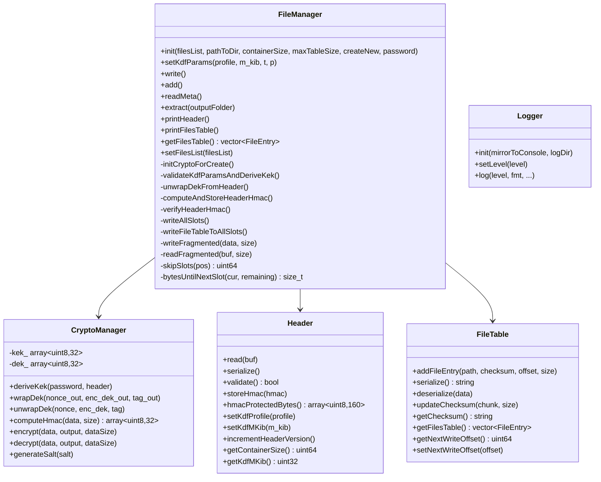

# Architecture

## Module Map



## CMake Build Targets

All targets are defined in `CMakeLists.txt`.

| Target | Type | Enabled by | Source files |
|--------|------|-----------|-------------|
| `scef_lib` | Static library | Always | `src/Header.cpp`, `src/CryptoManager.cpp`, `src/FileManager.cpp`, `src/FileTable.cpp`, `src/KdfProfiles.cpp`, `src/Logger.cpp` |
| `scef` | Executable | Always | `src/main.cpp` |
| `scef_unit_tests` | Executable | `SCEF_BUILD_TESTS=ON` (default) | `tests/unit/test_scef.cpp` |
| `scef-gui` | Executable | `SCEF_BUILD_GUI=ON` | `gui/main.cpp`, `gui/ScefController.cpp`, `gui/FileListModel.cpp`, `gui/DriveListModel.cpp`, `gui/qml/*.qml` |
| `generate_vectors` | Executable | `SCEF_BUILD_BROWSER_TESTS=ON` | `browser/test/generate_vectors.cpp` |
| `bench_kdf` | Executable | `SCEF_BUILD_BENCHMARKS=ON` | `benchmarks/bench_kdf.cpp` |

### Build Configurations

```
scef/build/debug    — CLI + unit tests (CMake, x64-Debug)
scef/build/gui      — CLI + GUI (CMake, -DSCEF_BUILD_GUI=ON)
```

### CMake Options

| Option | Default | Effect |
|--------|---------|--------|
| `SCEF_BUILD_TESTS` | `ON` | Build `scef_unit_tests` with GTest |
| `SCEF_BUILD_GUI` | `OFF` | Build `scef-gui` (requires Qt 6.5+) |
| `SCEF_BUILD_BROWSER_TESTS` | `OFF` | Build `generate_vectors` |
| `SCEF_BUILD_BENCHMARKS` | `OFF` | Build KDF benchmark |

### Dependencies

| Dependency | How found | Required by |
|------------|-----------|-------------|
| Botan 3.x | `pkg_check_modules(BOTAN botan-3)` then `find_package(Botan 3 CONFIG)` then vcpkg fallback | `scef_lib` |
| nlohmann_json | `find_package(nlohmann_json CONFIG REQUIRED)` | `scef_lib` |
| GTest | `find_package(GTest CONFIG REQUIRED)` | `scef_unit_tests` |
| Qt 6.5+ | `find_package(Qt6 6.5 REQUIRED)` | `scef-gui` |

## Directory Layout

```
scef/
├── CMakeLists.txt          — root build file (all targets)
├── CMakeSettings.json      — Visual Studio CMake presets
├── include/                — public headers (scef_lib API)
│   ├── Header.h            — SCEF header binary layout + class
│   ├── FileManager.h       — main coordinator (create/add/extract/list)
│   ├── CryptoManager.h     — Argon2id KDF, AES-256-GCM, HMAC
│   ├── FileTable.h         — file table (JSON + SHA-256)
│   ├── KdfProfiles.h       — predefined Argon2id profiles
│   ├── Logger.h            — thread-safe file logger + macros
│   └── enums/
│       ├── ECiphers.h      — ECipher enum (AES_256_GCM, Kuznechik_GCM)
│       ├── EKDF.h          — EKDF enum (Argon2id)
│       └── EKDFProfile.h   — EKDFProfile enum (FastAccess, Standard, HighSecurity, Browser)
├── src/                    — implementation
│   ├── main.cpp            — CLI entry point
│   ├── Header.cpp          — header parse/serialize/HMAC
│   ├── CryptoManager.cpp   — Botan crypto calls
│   ├── FileManager.cpp     — container I/O orchestration
│   ├── FileTable.cpp       — JSON file table + SHA-256
│   ├── KdfProfiles.cpp     — profile parameter table
│   └── Logger.cpp          — file logger implementation
├── gui/                    — Qt 6 QML GUI
│   ├── CMakeLists.txt
│   ├── main.cpp            — QGuiApplication, Material Dark theme
│   ├── ScefController.h/.cpp   — Q_OBJECT facade over FileManager
│   ├── FileListModel.h/.cpp    — QAbstractListModel for container files
│   ├── DriveListModel.h/.cpp   — QAbstractListModel for removable drives
│   └── qml/
│       ├── Main.qml        — root Window, StackView navigation
│       ├── StartPage.qml   — drive list, create/open entry points
│       ├── CreatePage.qml  — file selection, password, KDF settings
│       ├── FileListPage.qml— file list with add/extract actions
│       ├── PasswordDialog.qml — reusable modal password dialog
│       └── utils.js        — formatSize() helper
├── browser/                — HTML+JS browser viewer (no build needed)
│   ├── index.html          — development entry point (separate script tags)
│   ├── dist/index.html     — production build (single bundled file)
│   ├── build.py            — bundle script (inlines all JS + CSS)
│   ├── src/
│   │   ├── app.js          — main orchestration, unlock flow
│   │   ├── header.js       — header parser, slot offset computation
│   │   ├── kdf.js          — Argon2id via hash-wasm
│   │   ├── crypto.js       — WebCrypto HMAC + AES-256-GCM
│   │   ├── filetable.js    — file table decrypt + parse
│   │   ├── download.js     — chunk decryption, streaming + Blob download
│   │   ├── ui.js           — DOM manipulation helpers
│   │   └── style.css       — dark-themed CSS
│   ├── vendor/
│   │   ├── argon2.umd.min.js   — hash-wasm Argon2id WASM bundle
│   │   ├── sha256.umd.min.js   — hash-wasm SHA-256 (for streaming checksum)
│   │   └── jszip.min.js        — JSZip (Download All as ZIP)
│   └── test/               — Node.js unit tests for browser modules
├── tests/
│   ├── unit/test_scef.cpp  — GTest unit tests
│   └── integration/        — Python pytest integration tests (drives CLI binary)
│       ├── conftest.py     — shared fixtures, binary path, run_scef()
│       ├── test_create.py
│       ├── test_add.py
│       ├── test_list.py
│       ├── test_extract.py
│       ├── test_roundtrip.py
│       ├── test_header_resilience.py
│       ├── test_kdf_profiles.py
│       ├── test_errors.py
│       └── test_capacity_overflow.py
└── benchmarks/
    ├── CMakeLists.txt
    ├── bench_kdf.cpp       — Argon2id timing benchmark
    ├── run_benchmarks.py   — orchestrate + save CSV
    ├── plot_results.py     — matplotlib plots
    └── results/            — benchmark CSVs
```

## Component Responsibilities



## Three Operating Modes

| Mode | Binary | Crypto library | Capabilities |
|------|--------|---------------|-------------|
| A — Native CLI | `scef` | Botan 3.x | AES-256-GCM + Kuznechik-GCM, full read/write |
| A-GUI — Qt Desktop | `scef-gui` | Botan 3.x (via scef_lib) | AES-256-GCM + Kuznechik-GCM, full read/write, GUI |
| B — Browser | `browser/index.html` | WebCrypto + hash-wasm WASM | AES-256-GCM only, read-only decrypt + download |

## Key Implementation Constants

All defined in `include/Header.h`:

| Constant | Value | Purpose |
|----------|-------|---------|
| `HEADER_SIZE` | 4096 | Fixed header size in bytes |
| `BLOCK_SIZE` | 65536 | Data block (chunk) size in bytes |
| `DEFAULT_MAX_TABLE_SIZE` | 65536 | Reserved space per slot for file table |
| `NONCE_SIZE` | 12 | AES-GCM nonce size in bytes |
| `AUTH_TAG_SIZE` | 16 | AES-GCM authentication tag size in bytes |
| `ENCRYPTED_BLOCK_SIZE` | 65564 | BLOCK_SIZE + NONCE_SIZE + AUTH_TAG_SIZE |
| `MINIMAL_CONTAINER_SIZE` | 278528 | 4 * (HEADER_SIZE + DEFAULT_MAX_TABLE_SIZE) |
| `MAX_CONTAINER_SIZE` | 2^41 | 2 TiB |
| `SLOT_COUNT` | 4 | Number of redundant header+table slots |
| `CONTAINER_FILE_NAME` | `"container.scef"` | Fixed filename within the container directory |
