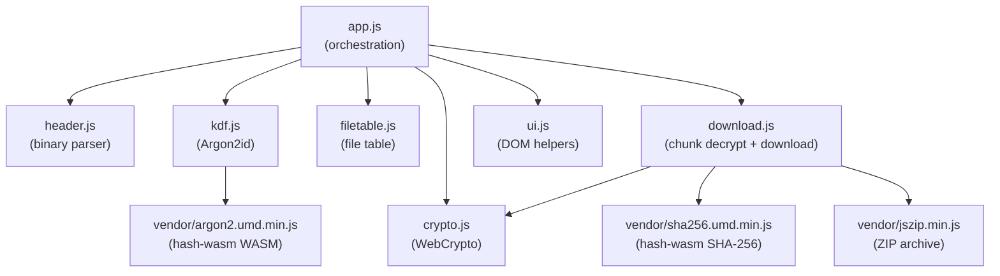
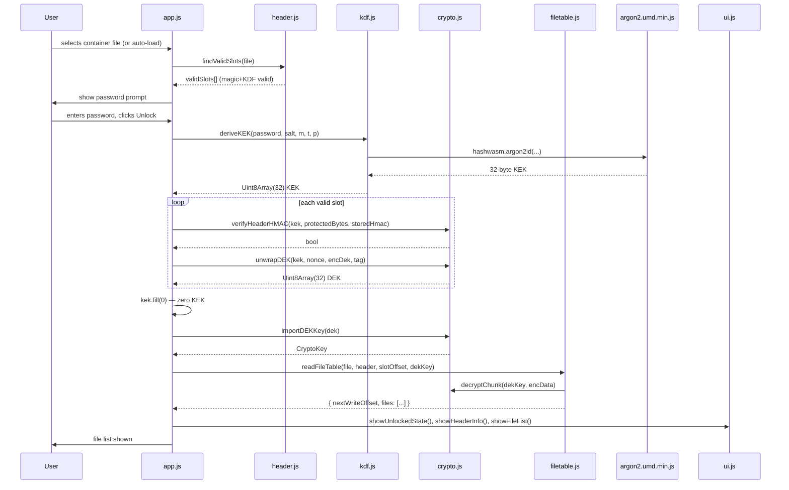

# Browser Viewer

Self-contained HTML+JS viewer for SCEF containers. No install, no server, no build step required for deployment. Read-only: decrypt and download only.

## Files

```
browser/
├── index.html              — development entry (separate script tags)
├── dist/index.html         — production build (all JS/CSS inlined, single file)
├── build.py                — bundle script: reads index.html, inlines all src/ and vendor/
├── src/
│   ├── app.js              — main orchestration
│   ├── header.js           — binary header parser, slot offset computation
│   ├── kdf.js              — Argon2id via hash-wasm
│   ├── crypto.js           — WebCrypto: HMAC-SHA256, AES-256-GCM
│   ├── filetable.js        — file table decrypt + JSON parse
│   ├── download.js         — chunk decryption, streaming + Blob download, ZIP
│   ├── ui.js               — DOM helpers, status messages, file list rendering
│   └── style.css           — dark-themed CSS
└── vendor/
    ├── argon2.umd.min.js   — hash-wasm Argon2id (UMD, WASM bundled)
    ├── sha256.umd.min.js   — hash-wasm SHA-256 (for streaming checksum)
    └── jszip.min.js        — JSZip 3.x (Download All as ZIP)
```

## Deployment

Place `dist/index.html` in the same directory as `container.scef` on the USB drive. Opening `index.html` in a browser auto-loads the container via `fetch('./container.scef')`.

Fallback: if `fetch` fails (Chrome `file://` restriction), a file picker is shown.

## Module Architecture



Modules communicate via global functions (no ES modules — UMD pattern for `file://` compatibility). All globals are namespaced per-file (`SCEF`, `UI`, etc.).

## Unlock Flow



## Module API Reference

### header.js

**Global constants:** `SCEF` object (mirrors `include/Header.h`).

```js
// All header field offsets, constants, cipher IDs, KDF bounds
const SCEF = Object.freeze({
    HEADER_SIZE: 4096,
    BLOCK_SIZE: 65536,
    NONCE_SIZE: 12,
    AUTH_TAG_SIZE: 16,
    HMAC_PROTECTED_SIZE: 0x00A0,
    SLOT_COUNT: 4,
    SLOT_PERCENTAGES: [0, 25, 50, 75],
    MAGIC: [0x53, 0x43, 0x45, 0x46],
    CIPHER_AES_256_GCM: 0x01,
    CIPHER_KUZNECHIK_GCM: 0x02,
    KDF_M_KIB_BROWSER_MAX: 2047 * 1024,  // 2047 MiB WASM limit
    // ... all POS_* offsets
});

// Compute slot byte offset (BigInt arithmetic to avoid JS precision loss)
function computeSlotOffset(containerSize, percent, headerSize) → number

// Compute all 4 slot offsets
function computeSlotOffsets(containerSize, headerSize) → number[]

// Parse 4096-byte ArrayBuffer into structured header object
// Returns null if magic bytes don't match
function parseHeader(buffer) → object|null

// Validate KDF and structural params (DoS prevention, before HMAC)
// Returns null if valid, error string if invalid
function validateKdfParams(header) → string|null
```

**Parsed header object fields:**

| Field | JS type | Description |
|-------|---------|-------------|
| `versionMajor` | number | |
| `versionMinor` | number | |
| `headerSize` | number | |
| `cipherId` | number | |
| `kdfId` | number | |
| `kdfProfileId` | number | |
| `kdfMKib` | number | |
| `kdfT` | number | |
| `kdfP` | number | |
| `salt` | Uint8Array(32) | |
| `dekNonce` | Uint8Array(12) | |
| `encryptedDek` | Uint8Array(32) | |
| `dekAuthTag` | Uint8Array(16) | |
| `containerSize` | number | |
| `fileTableSize` | number | |
| `maxTableSize` | number | |
| `fileCount` | number | |
| `blockSize` | number | |
| `headerVersion` | number | |
| `flags` | number | |
| `headerHmac` | Uint8Array(32) | |
| `hmacProtectedBytes` | Uint8Array(160) | bytes [0x0000..0x009F], copied |

### kdf.js

```js
// Derive 256-bit KEK via hash-wasm Argon2id
// Returns Promise<Uint8Array(32)>
async function deriveKEK(password, salt, mKib, t, p)
```

Uses `hashwasm.argon2id()` from the UMD WASM bundle. The WASM module is loaded synchronously when the page loads. Browser memory limit: `SCEF.KDF_M_KIB_BROWSER_MAX = 2047 * 1024` KiB (typed arrays are capped at 2^31 bytes).

### crypto.js

```js
// Import raw key bytes as CryptoKey
async function importKey(keyBytes, algorithm, usages) → Promise<CryptoKey>
    // algorithm: 'AES-GCM' or 'HMAC'

// Compute HMAC-SHA256
async function computeHMAC(key, data) → Promise<Uint8Array(32)>

// Constant-time Uint8Array comparison
function constantTimeEqual(a, b) → boolean

// Verify header HMAC (constant-time)
async function verifyHeaderHMAC(kek, hmacProtectedBytes, storedHmac) → Promise<boolean>

// Unwrap (decrypt) DEK from header fields
// Throws on wrong password / auth failure
async function unwrapDEK(kek, dekNonce, encryptedDek, dekAuthTag) → Promise<Uint8Array(32)>

// Decrypt a single data chunk: [nonce 12B][ciphertext N B][auth tag 16B]
// Throws on authentication failure (corrupted data)
async function decryptChunk(dekKey, chunkData) → Promise<Uint8Array>

// Import DEK as CryptoKey once for all chunk decryptions
async function importDEKKey(dek) → Promise<CryptoKey>

// SHA-256 via WebCrypto (used for file integrity check after blob assembly)
async function sha256hex(data) → Promise<string>  // hex, uppercase
```

**WebCrypto wire format note:** Botan stores DEK as `[ciphertext 32B][tag 16B]` in separate header fields. WebCrypto `decrypt` expects `ciphertext || tag` as a single buffer. `unwrapDEK` assembles them before calling `crypto.subtle.decrypt`.

### filetable.js

```js
// Read and decrypt the encrypted file table from a slot
async function readFileTable(file, header, slotOffset, dekKey)
// → Promise<{ nextWriteOffset: number, files: Array<FileEntryObj> }>
```

**FileEntryObj:**

```js
{
    name:           string,
    size:           number,
    offset:         number,   // container byte offset of first chunk
    chunks:         number,
    checksumSha256: string    // hex uppercase
}
```

### download.js

```js
// Download a single file (streaming or Blob fallback)
async function downloadFile(containerFile, header, fileEntry, dekKey, slotOffsets)

// Download all files as a single ZIP archive (Blob only, max 500 MiB total)
async function downloadAllAsZip(containerFile, header, files, dekKey, slotOffsets)
```

**Download modes:**

| Mode | API | Memory | Size limit | Browsers |
|------|-----|--------|-----------|---------|
| Streaming | `window.showSaveFilePicker()` + `FileSystemWritableFileStream` | One chunk at a time (64 KiB) | None | Chrome, Edge |
| Blob fallback | `URL.createObjectURL()` + `<a>` click | Full file in memory | 500 MiB (`MAX_BLOB_SIZE`) | All |

The streaming path is tried first. If `showSaveFilePicker` is unavailable or throws `SecurityError` (e.g. `file://` in Chrome), the Blob fallback is used. `AbortError` (user cancels the save dialog) is handled gracefully.

**Buffered reader:** Both paths use `createBufferedReader()` — reads 8 MiB blocks from the `File` object (`READ_AHEAD_SIZE = 8 * 1024 * 1024`) and serves individual chunk reads from the in-memory buffer, reducing async `file.slice()` calls.

**Slot-skipping:** `readFragmentedBuffered()` mirrors C++ `FileManager::readFragmented()` — skips over slot reserved areas when reading data blocks that span slot boundaries.

**Checksum verification:**
- Blob path: `sha256hex(assembled)` via WebCrypto after assembly.
- Streaming path: incremental SHA-256 via `hashwasm.createSHA256()` fed per chunk, finalized after all chunks are written.

### ui.js

```js
const UI = {
    init(),                          // bind DOM element references
    status(msg, type),              // type: 'info', 'success', 'error'
    showPasswordSection(),
    hidePasswordSection(),
    showHeaderInfo(header, slotIndex),
    showFileList(files),
    showLockButton(),
    hideLockButton(),
    showUnlockedState(),            // hide file picker + password, show content + lock
    showLockedState(),              // clear content, hide lock button
    clearResults(),
};

function formatSize(bytes) → string    // e.g. "1.5 MiB"
function escapeHtml(str) → string      // XSS prevention
```

### app.js

**State variables:**

```js
let containerFile   = null;  // File/Blob with .size
let validSlots      = [];    // [{header, slotIndex}]
let activeHeader    = null;
let activeSlotIndex = -1;
let activeDEK       = null;  // Uint8Array(32) — zeroed on lock
let activeDEKKey    = null;  // CryptoKey
let activeFileTable = null;
```

**Key functions:**

| Function | Description |
|----------|-------------|
| `tryAutoLoad()` | `fetch('./container.scef')` — works on localhost and Firefox `file://` |
| `onFileSelected(event)` | Fallback: manual file picker |
| `validateAndPromptPassword()` | `findValidSlots()` → cipher check → show password UI |
| `findValidSlots(file)` | Read all 4 slot headers, return those with valid magic + KDF params |
| `onUnlock()` | Full auth sequence: Argon2id → HMAC verify → DEK unwrap → file table decrypt |
| `onLock()` | `activeDEK.fill(0)`, clear state, return to password prompt |
| `attachDownloadHandlers()` | Wire download buttons to `downloadFile()` and `downloadAllAsZip()` |

## Limitations

| Limitation | Reason |
|-----------|--------|
| AES-256-GCM only | Kuznechik-GCM requires WASM compilation; deferred |
| Read-only | No write operations via WebCrypto |
| Max Argon2id memory: 2047 MiB | WASM typed arrays capped at 2^31 bytes |
| Blob download limit: 500 MiB | Browser heap; use streaming (Chrome/Edge) for larger files |
| No SecureZeroMemory / mlock | JavaScript GC may keep key bytes in memory; documented trade-off for portability |
| KEK zeroed best-effort | `kek.fill(0)` after use but GC may have copied the buffer |
