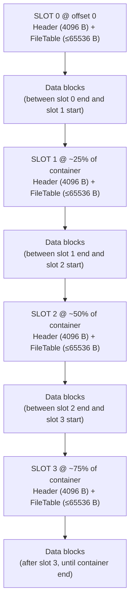

# Container Format (SCEF v1.0)

## Overview

A SCEF container is a single file named `container.scef`. It uses a slot-based layout with 4 redundant copies of the header and file table, interleaved with data blocks.



### Slot Offset Formula

Source: `include/FileManager.h:27`

```
slot_offset(N%) = floor(container_size * N / 100 / header_size) * header_size
```

For N = 0, offset is always 0. Percentages: `[0, 25, 50, 75]`.

Each slot reserves `header_size + max_table_size` bytes. Default reservation per slot: `4096 + 65536 = 69632` bytes. Total reserved by 4 slots: `4 * 69632 = 278528` bytes — this is the minimum container size.

---

## Header Binary Layout

Source: `include/Header.h:65-94` (spec Table 4.2)

Total size: **4096 bytes**.

| Offset | Size | Field | Type | Value / Description |
|--------|------|-------|------|---------------------|
| `0x0000` | 4 | `magic` | `uint8[4]` | `"SCEF"` = `0x53 0x43 0x45 0x46` |
| `0x0004` | 2 | `version_major` | `uint16_le` | `1` |
| `0x0006` | 2 | `version_minor` | `uint16_le` | `0` |
| `0x0008` | 4 | `header_size` | `uint32_le` | `4096` |
| `0x000C` | 1 | `cipher_id` | `uint8` | `0x01` = AES-256-GCM, `0x02` = Kuznechik-GCM |
| `0x000D` | 1 | `kdf_id` | `uint8` | `0x01` = Argon2id |
| `0x000E` | 2 | `kdf_profile_id` | `uint16_le` | `0` = custom, `1` = FastAccess, `2` = Standard, `3` = HighSecurity, `4` = Browser |
| `0x0010` | 4 | `kdf_m_kib` | `uint32_le` | Argon2id memory in KiB |
| `0x0014` | 4 | `kdf_t` | `uint32_le` | Argon2id iterations |
| `0x0018` | 4 | `kdf_p` | `uint32_le` | Argon2id parallelism |
| `0x001C` | 32 | `salt` | `uint8[32]` | 256-bit cryptographically random salt |
| `0x003C` | 12 | `dek_nonce` | `uint8[12]` | 96-bit nonce for DEK encryption |
| `0x0048` | 32 | `encrypted_dek` | `uint8[32]` | AES-256-GCM encrypted DEK ciphertext |
| `0x0068` | 16 | `dek_auth_tag` | `uint8[16]` | AES-256-GCM authentication tag for DEK |
| `0x0078` | 8 | `container_size` | `uint64_le` | Total container file size in bytes |
| `0x0080` | 4 | `file_table_size` | `uint32_le` | Current encrypted file table size in bytes |
| `0x0084` | 4 | `max_table_size` | `uint32_le` | Reserved space per slot for file table (default 65536) |
| `0x0088` | 4 | `file_count` | `uint32_le` | Number of files in container |
| `0x008C` | 4 | `block_size` | `uint32_le` | Data block plaintext size (default 65536) |
| `0x0090` | 4 | `header_version` | `uint32_le` | Monotonic update counter (incremented on each write) |
| `0x0094` | 4 | `flags` | `uint32_le` | Bit flags (reserved, currently 0) |
| `0x0098` | 8 | `reserved_0` | `uint8[8]` | Reserved (zeros) |
| `0x00A0` | 32 | `header_hmac` | `uint8[32]` | **HMAC-SHA256** of bytes `[0x0000..0x009F]` using KEK |
| `0x00C0` | 320 | `reserved` | `uint8[320]` | Reserved (zeros) |
| `0x0200` | 512 | `json_metadata` | `uint8[512]` | UTF-8 JSON metadata (optional, null-terminated) |
| `0x0400` | 3072 | `padding` | `uint8[3072]` | Zero-padding to reach 4096 bytes total |

### HMAC Coverage

The `header_hmac` at `0x00A0` covers bytes `[0x0000..0x009F]` (160 bytes = `HMAC_PROTECTED_SIZE`). This includes all fields from `magic` through `reserved_0` — everything except the HMAC itself and the fields after it.

The HMAC key is the **KEK** (not the DEK). This means header integrity can only be verified after Argon2id KDF is run. The sequence is: derive KEK → verify HMAC → unwrap DEK (authenticate-then-decrypt).

Source: `include/Header.h:61`, `src/FileManager.cpp:244-265`

---

## KDF Profiles

Source: `src/KdfProfiles.cpp:7-11`

| Profile | ID | CLI name | m (KiB) | t | p | Approx time |
|---------|----|----------|---------|---|---|-------------|
| FastAccess | `0x0001` | `fast` | 19456 (19 MiB) | 2 | 1 | ~0.3-0.7s |
| Standard | `0x0002` | `default` | 65536 (64 MiB) | 3 | 4 | ~0.8-1.5s |
| HighSecurity | `0x0003` | `high` | 262144 (256 MiB) | 5 | 8 | ~4-10s |
| Browser | `0x0004` | `browser` | 47104 (46 MiB) | 1 | 1 | ~0.5-1.0s (WASM) |
| Custom | `0x0000` | — | user-specified | user | user | varies |

Default when `--kdf-profile` is not specified: **Standard** (`default`).

KDF parameter validation bounds (from `include/KdfProfiles.h`):

| Parameter | Min | Max | Warning threshold |
|-----------|-----|-----|-------------------|
| m (KiB) | 1 | 4,194,304 (4096 MiB) | below 8192 (8 MiB) |
| t | 1 | 100 | — |
| p | 1 | 64 | — |

---

## Cipher IDs

Source: `include/enums/ECiphers.h`

| ID | Name | Support |
|----|------|---------|
| `0x01` | AES-256-GCM | Native CLI, GUI, Browser viewer |
| `0x02` | Kuznechik-GCM | Native CLI and GUI only (Botan) |

---

## File Table Structure

The file table is stored immediately after the header in each slot (at `slot_offset + 4096`). It is encrypted as a single block.

**Wire format:**
```
[nonce 12 B][JSON ciphertext N B][auth tag 16 B]
```
Total `file_table_size` = `N + 12 + 16`. The field `file_table_size` in the header holds this total. The reserved area `max_table_size` (default 65536) is zero-padded after the encrypted payload.

**Plaintext JSON schema** (from `include/FileTable.h:10-20` and `src/FileTable.cpp:56-69`):

```json
{
  "next_write_offset": 131072,
  "files": [
    {
      "name": "document.pdf",
      "size": 1048576,
      "offset": 69632,
      "chunks": 16,
      "checksum_sha256": "A1B2C3D4..."
    }
  ]
}
```

| Field | Type | Description |
|-------|------|-------------|
| `next_write_offset` | `uint64` | Container byte offset immediately after the last written data chunk; used by `add()` to resume without scanning |
| `files[].name` | string | Filename only (no path components); duplicates get `"(copy)"` prefix |
| `files[].size` | uint64 | Plaintext file size in bytes (actual bytes written, not filesystem stat) |
| `files[].offset` | uint64 | Container byte offset of the first encrypted chunk of this file |
| `files[].chunks` | uint64 | Number of encrypted chunks |
| `files[].checksum_sha256` | string | Hex-encoded uppercase SHA-256 of the complete plaintext |

---

## Data Block Layout

Each encrypted data block has the format:

```
[nonce 12 B][ciphertext N B][auth tag 16 B]
```

Where `N` is at most `BLOCK_SIZE` (65536) bytes of plaintext. The last chunk of a file may be smaller. Total block size on disk: `N + 28` bytes.

Data blocks are written sequentially starting at `slot_0_end = HEADER_SIZE + max_table_size`. Writing and reading skip over slot reserved areas transparently via `writeFragmented()` / `readFragmented()` in `FileManager`.

**Slot-skipping logic** (`src/FileManager.cpp:97-114`):

```
skipSlots(pos):
    for each slot_offset in slotOffsets_:
        if pos is inside [slot_offset, slot_offset + header_size + max_table_size):
            return slot_offset + header_size + max_table_size
    return pos

bytesUntilNextSlot(cur, remaining):
    return min(remaining, distance to next slot start)
```

---

## Crash Resilience

All 4 slots are kept identical. On write (`writeFileTableToAllSlots`), the header is written to all 4 slots sequentially with `flush()` between them.

On open (`readMeta`), the algorithm (`src/FileManager.cpp:417-582`):

1. Compute 4 slot offsets from file size.
2. For each slot: read header, check magic bytes.
3. If magic valid: derive KEK once (Argon2id) — expensive, done at most twice total.
4. Verify header HMAC using KEK.
5. If HMAC valid: unwrap DEK (AES-256-GCM decrypt).
6. First slot passing all checks wins. Read file table from that slot.
7. If no slot passes: error "wrong password or container corrupted".

KEK re-derivation: if a slot has valid magic but different salt/KDF params from the KEK-source slot, one re-derivation is allowed (corruption case). If salt matches → wrong password (re-deriving gives same wrong KEK). Maximum 2 Argon2id calls per open.

---

## Size Calculations

```
available_data_capacity = container_size - SLOT_COUNT * (header_size + max_table_size)

encrypted_size(plain_size):
    full_chunks = plain_size / block_size
    last = plain_size % block_size
    enc = full_chunks * (block_size + 12 + 16)
    if last > 0: enc += last + 12 + 16
    return enc
```

Source: `src/FileManager.cpp:268-305`
