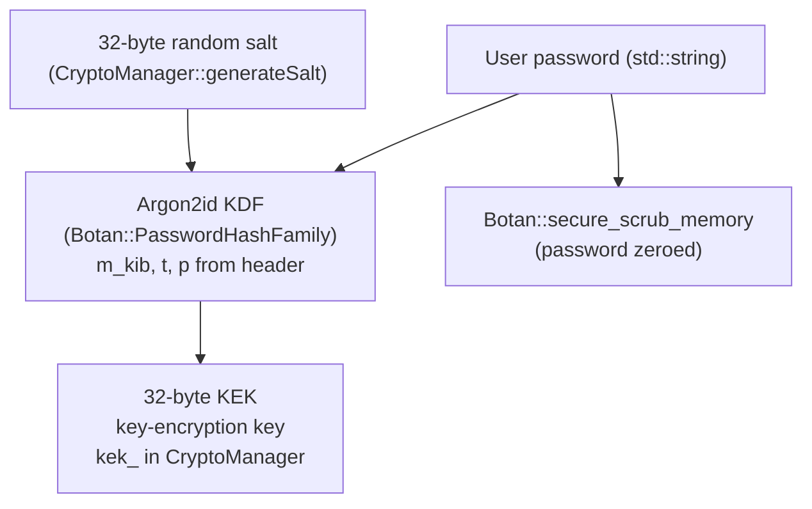
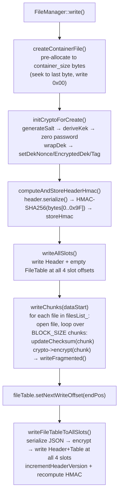
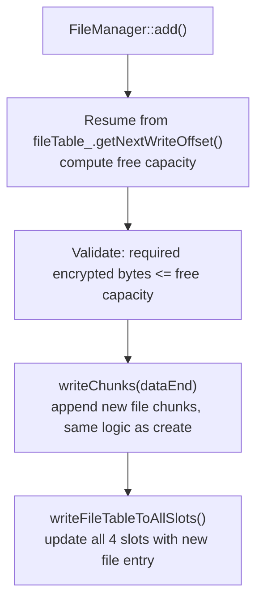
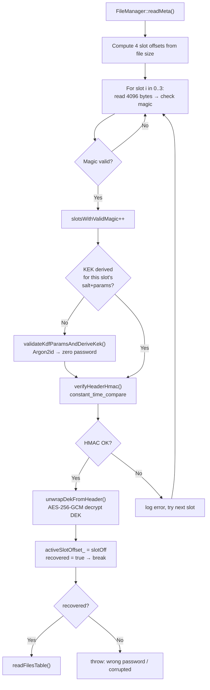
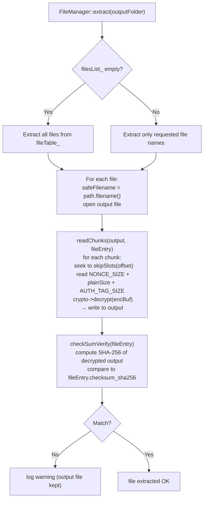
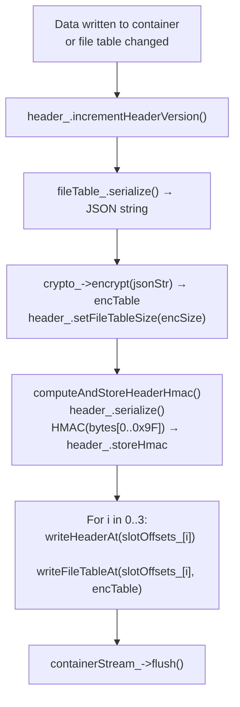
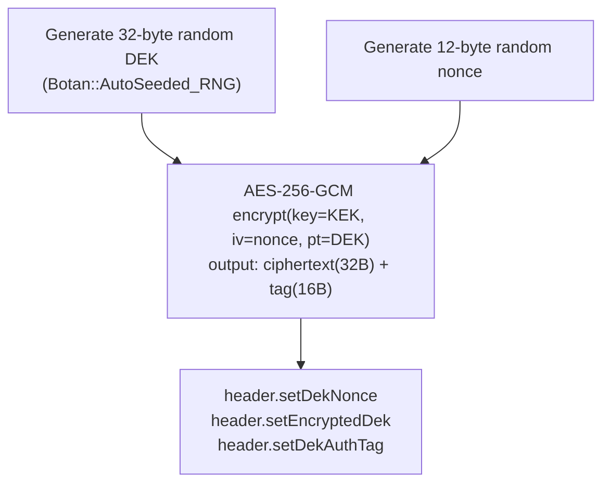
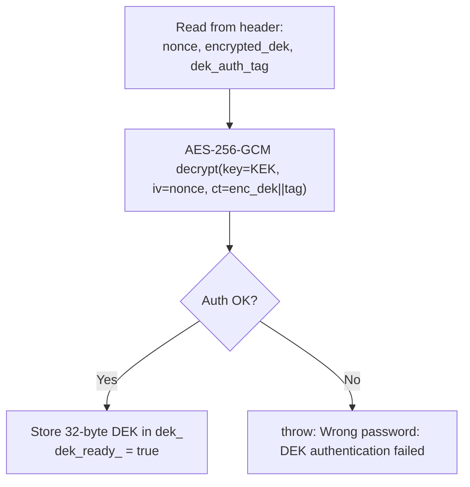

# Data Flows

## Key Derivation Flow



Source: `src/CryptoManager.cpp:26-41`, `src/FileManager.cpp:179-233`

On **create**: salt is generated fresh, then KEK is derived. Password is zeroed immediately after `deriveKek()` returns.

On **open**: salt and KDF params are read from the first magic-valid slot header. Password is zeroed after derivation. At most 2 derivations per open (corruption recovery case).

---

## Container Creation Flow



Source: `src/FileManager.cpp:643-670`

### writeChunks detail

For each file:
1. Open source file for reading.
2. `fileTable_.resetChecksum()`.
3. Read up to `BLOCK_SIZE` bytes at a time.
4. `fileTable_.updateChecksum(chunk)` — feeds SHA-256 hasher.
5. `crypto_->encrypt(chunk, encBuf, chunkSize)` — writes `[nonce 12B][ciphertext][tag 16B]`.
6. `writeFragmented(encBuf)` — writes to container, skipping slot areas.
7. After all chunks: `fileTable_.getChecksum()` — hex SHA-256 of plaintext.
8. `fileTable_.addFileEntry(path, checksum, startOffset, actualSize)`.

---

## Add File Flow



The `next_write_offset` field in the file table JSON is persisted so `add()` can resume without scanning the entire container.

Source: `src/FileManager.cpp:672-730`

---

## Open Container (readMeta) Flow



Source: `src/FileManager.cpp:417-582`

---

## Extract Flow



Source: `src/FileManager.cpp:584-641`

---

## Header Sync Flow (after every write)



Source: `src/FileManager.cpp:389-413`

---

## DEK Wrap/Unwrap

### Wrap (on create)



### Unwrap (on open)



Source: `src/CryptoManager.cpp:43-115`

---

## Chunk Encryption/Decryption

### Encrypt one chunk

```
Input: plaintext data (up to 65536 bytes)
1. Generate random 12-byte nonce (Botan::AutoSeeded_RNG)
2. AES-256-GCM encrypt(key=DEK, iv=nonce, plaintext)
   → ciphertext (same length as plaintext) + 16-byte auth tag
3. Write: [nonce 12B][ciphertext N B][auth tag 16B]
```

### Decrypt one chunk

```
Input: [nonce 12B][ciphertext N B][auth tag 16B]
1. Read nonce (first 12 bytes)
2. AES-256-GCM decrypt(key=DEK, iv=nonce, ciphertext+tag)
   → plaintext N bytes
   → throws on auth failure (corrupted data)
```

Source: `src/CryptoManager.cpp:136-210`

---

## Browser Unlock Flow

See [browser-viewer.md](browser-viewer.md) for the full JS sequence diagram.

Key differences from native:
- Argon2id via hash-wasm WASM (not Botan)
- AES-256-GCM via WebCrypto API (`crypto.subtle`)
- HMAC-SHA256 via WebCrypto (`HMAC` + `SHA-256`)
- All async (Promises)
- No re-derivation on corruption: derives once, tries all valid slots with the same KEK
- KEK zeroed best-effort (`kek.fill(0)`)
