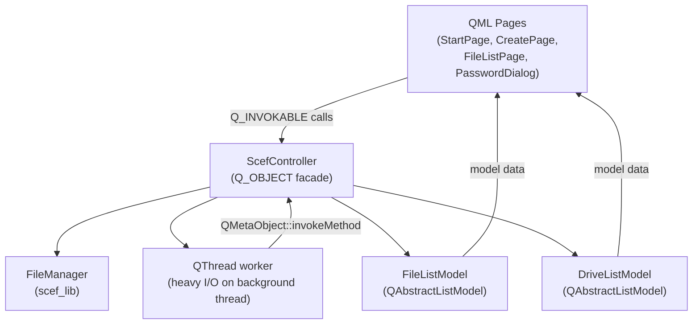
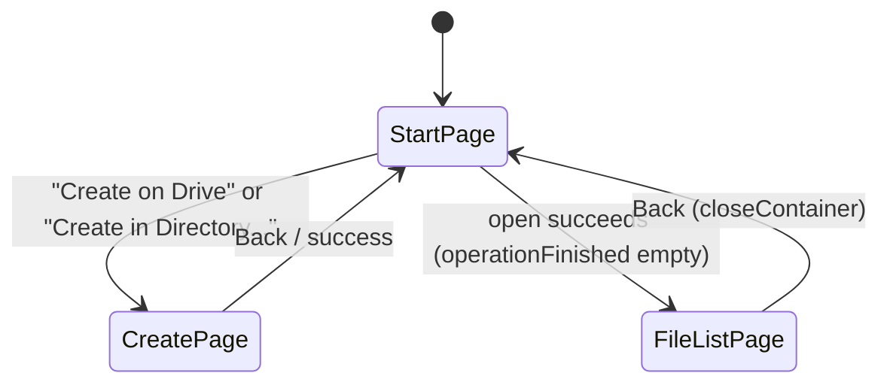

# GUI Reference

Binary: `scef-gui` (built from `gui/` with `-DSCEF_BUILD_GUI=ON`)

Qt version: 6.5+ (tested with 6.11.0, MSVC 2022 x64).  
Theme: Material Dark, primary color Red, accent color LightGreen.

## Architecture



**Facade pattern:** `ScefController` is a `QObject` exposed to QML as `controller` context property. It wraps `FileManager` and runs heavy operations on a `QThread` worker to avoid blocking the UI.

Source: `gui/main.cpp:29` — `engine.rootContext()->setContextProperty("controller", &controller)`

---

## ScefController

Source: `gui/ScefController.h`

### Properties

| Property | Type | Signal | Description |
|----------|------|--------|-------------|
| `fileListModel` | `FileListModel*` | — | Model of files in the open container |
| `driveListModel` | `DriveListModel*` | — | Model of detected removable drives |
| `containerOpen` | `bool` | `containerOpenChanged()` | Whether a container is currently open |
| `busy` | `bool` | `busyChanged()` | Whether a background operation is running |
| `currentContainerPath` | `QString` | `containerOpenChanged()` | Directory path of the open container |

### Signals

| Signal | Description |
|--------|-------------|
| `containerOpenChanged()` | Emitted when container is opened or closed |
| `busyChanged()` | Emitted when a background task starts or finishes |
| `operationFinished(QString error)` | Emitted after every async operation; `error` is empty on success |

### Invokable Methods

```cpp
Q_INVOKABLE QString createContainer(
    const QString& destDir,      // container directory (file:// URL or local path)
    const QStringList& files,    // file paths to encrypt
    const QString& password,
    quint64 sizeMB,              // container size in MB
    int kdfProfileIndex = 0,     // 0=Standard, 1=Fast, 2=High, 3=Browser, 4=Custom
    int kdfM_MiB = 64,           // used only when kdfProfileIndex == 4
    int kdfT = 3,
    int kdfP = 4
);
// Returns empty string on success, error message on synchronous failure.
// Async errors come via operationFinished(error).

Q_INVOKABLE QString openContainer(
    const QString& containerPath,  // path to container.scef (file:// URL or local)
    const QString& password
);

Q_INVOKABLE QString addFiles(const QStringList& filePaths);

Q_INVOKABLE QString extractFiles(
    const QStringList& fileNames,  // names of files to extract (empty = all)
    const QString& outputDir
);

Q_INVOKABLE void closeContainer();
```

**Profile index mapping** (`gui/ScefController.cpp:64-71`):

| Index | Profile |
|-------|---------|
| 0 | Standard (default) |
| 1 | Fast |
| 2 | High |
| 3 | Browser |
| 4 | Custom (manual m/t/p) |

### Async Execution

Heavy work (Argon2id, file I/O) runs on a dedicated `QThread`. The pattern (`gui/ScefController.cpp:228-271`):

```
runAsync(unique_ptr<FileManager> fm, workFn, onSuccess):
    busy_ = true; emit busyChanged()
    Start QThread:
        workFn(fm.get())  ← runs on worker thread
        QMetaObject::invokeMethod(qApp, ← back on main thread
            if success: fileManager_ = move(fm); onSuccess()
            always: busy_ = false; emit busyChanged(); emit operationFinished(error)
        )
    thread->start()
    connect(thread->finished, thread->deleteLater)
```

The `QPointer<ScefController>` guard ensures the main-thread callback is a no-op if the controller is destroyed while the worker runs.

### Password Security

Passwords are stored as `std::string currentPassword_` in `ScefController`. On `closeContainer()` and in the destructor, `scrubPassword()` is called, which uses `Botan::secure_scrub_memory` before clearing the string.

Source: `gui/ScefController.cpp:282-288`

---

## FileListModel

Source: `gui/FileListModel.h`

`QAbstractListModel` wrapping `std::vector<FileEntry>`. Exposed to QML as `controller.fileListModel`.

### Roles

| Role name | Role ID | Type | Description |
|-----------|---------|------|-------------|
| `name` | `NameRole` | `QString` | File name |
| `size` | `SizeRole` | `quint64` | Plaintext file size in bytes |
| `checksum` | `ChecksumRole` | `QString` | Hex SHA-256 checksum |

### Key Methods

```cpp
void setFiles(const std::vector<FileEntry>& files); // replace entire list
void clear();                                         // clear list
Q_INVOKABLE QString nameAtRow(int row) const;        // get name for checkbox extraction
```

### Signals

| Signal | Description |
|--------|-------------|
| `countChanged()` | Emitted when the number of rows changes |

---

## DriveListModel

Source: `gui/DriveListModel.h`

`QAbstractListModel` wrapping `std::vector<DriveEntry>`. Lists removable drives detected on Windows.

### DriveEntry struct

```cpp
struct DriveEntry {
    std::string letter;      // e.g. "E:\"
    std::string label;       // volume label, e.g. "KINGSTON"
    uint64_t freeSpace;      // bytes free
    uint64_t totalSpace;     // bytes total
    bool hasContainer;       // container.scef exists in root of drive
};
```

### Roles

| Role name | Role ID | Description |
|-----------|---------|-------------|
| `letter` | `LetterRole` | Drive letter string |
| `label` | `LabelRole` | Volume label |
| `freeSpace` | `FreeSpaceRole` | Free space in bytes |
| `totalSpace` | `TotalSpaceRole` | Total space in bytes |
| `hasContainer` | `HasContainerRole` | Whether container.scef exists |

### Invokable Methods

```cpp
Q_INVOKABLE void refresh();                   // re-scan drives
Q_INVOKABLE QString pathAtRow(int row) const; // returns "E:\\" (trailing slash)
Q_INVOKABLE bool hasContainerAtRow(int row) const;
```

---

## QML Pages

### Main.qml

Root window. 900×600 pixels. Material Dark theme (Red primary, LightGreen accent).

Contains a `StackView` with three components:
- `StartPage` — initial page
- `CreatePage` — pushed from StartPage
- `FileListPage` — pushed after successful create or open



### StartPage.qml

**Purpose:** Entry point. Shows list of removable drives; allows create or open.

**Key UI elements:**
- Drive list (`ListView` bound to `controller.driveListModel`)
- "Create on Drive" button — pushes `CreatePage` with `initialDestDir` set to drive path; warns if container already exists
- "Open from Drive" button — opens `PasswordDialog`, then calls `controller.openContainer()`
- "More options" collapsible section — "Create in Directory..." (`FolderDialog`) and "Open File..." (`FileDialog` filtering `*.scef`)
- Busy dialog (modal, no-close) shown while KDF is running
- Error label (red, below buttons)

**Overwrite protection:** If `controller.driveListModel.hasContainerAtRow(index)` is true, a confirmation dialog appears before navigating to `CreatePage`.

### CreatePage.qml

**Purpose:** Configure and create a new container.

**Inputs:**
- File list (via `FileDialog.OpenFiles`; `.scef` files are filtered out)
- Password + confirm password (with match indicator)
- Container size in MB (SpinBox, 1–102400)
- Security Profile (ComboBox):
  - Standard (recommended) — 1024 MiB, t=1, p=4, ~0.6-1.1s
  - Fast — 256 MiB, t=1, p=4, ~0.1-0.3s
  - High — 2048 MiB, t=1, p=4, ~1.2-1.9s
  - Browser — 64 MiB, t=1, p=1, ~0.1s (WASM)
  - Custom
- Advanced KDF Settings (collapsible):
  - Memory (MiB), Iterations, Parallelism spinboxes
  - Editing any spinbox automatically sets profile to "Custom"

**Validation before `Create` button is enabled:**
- `initialDestDir` must be set
- At least one file selected
- Password non-empty and matches confirm
- Not `controller.busy`

**Async handling:**
- `controller.createContainer()` returns synchronously empty or an error string
- `operationFinished(error)` is handled via `Connections` (only when page is active in StackView)
- On success: success overlay shown for 1.5 s, then `stackView.pop(null)` returns to StartPage

### PasswordDialog.qml

**Purpose:** Reusable modal password dialog. Used by `StartPage` for open operations.

Exposes `property string password`. On `accepted`, the caller reads the password, clears it immediately after use.

### FileListPage.qml

**Purpose:** Browse and manage files in the open container.

**Header row:** Container path, file count.

**File list** (`ListView` bound to `controller.fileListModel`):
- Columns: checkbox, Name, Size (formatted), SHA-256 (first 16 chars + `...`)
- Multi-selection via checkboxes (`selectedIndices` map)

**Actions:**
- "Add Files" — opens `FileDialog.OpenFiles`, calls `controller.addFiles(files)`
- "Extract Selected (N)" or "Extract All" — opens `FolderDialog`, calls `controller.extractFiles(names, dir)`
- "Back" — `controller.closeContainer()` then `stackView.pop(null)`

**Busy overlay:** Shown when `controller.busy`; shows "Adding files..." or "Extracting files..." based on `pendingOperation`.

**Async result:** `Connections` on `controller.operationFinished` (active only when page is the active StackView item).

---

## GUI Logging

Log directory: `<executable_dir>/logs/`. Console mirroring disabled (GUI does not share stdout with any terminal).

Source: `gui/main.cpp:15-18`

---

## Build

```sh
cmake -DSCEF_BUILD_GUI=ON -B build/gui
cmake --build build/gui --config Release
```

The `scef-gui` target has `WIN32_EXECUTABLE TRUE` set — no console window on Windows.
